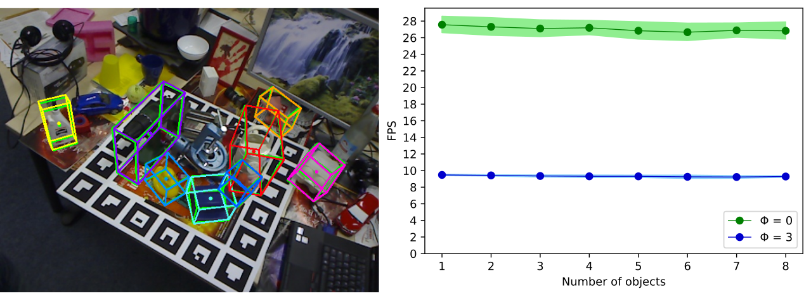

# EfficientPose
This is the official implementation of [EfficientPose](https://arxiv.org/abs/2011.04307). 
We based our work on the Keras EfficientDet implementation [xuannianz/EfficientDet](https://github.com/xuannianz/EfficientDet) which again builds up on the great Keras RetinaNet implementation [fizyr/keras-retinanet](https://github.com/fizyr/keras-retinanet), the official EfficientDet implementation [google/automl](https://github.com/google/automl) and [qubvel/efficientnet](https://github.com/qubvel/efficientnet).



## Installation

1) Clone this repository
2) Create a new environment with ```conda create -n EfficientPose python==3.7```
3) Activate that environment with ```conda activate EfficientPose```
4) Install Tensorflow 1.15.0 with ```conda install tensorflow-gpu==1.15.0```
5) Go to the repo dir and install the other dependencys using ```pip install -r requirements.txt```
6) Compile cython modules with ```python setup.py build_ext --inplace```

## Dataset and pretrained weights

You can download the Linemod and Occlusion datasets and the pretrained weights from [here](https://drive.google.com/drive/folders/1VcBLcIBhuT5MmXfE9NMrFdAk2xzF3mP5?usp=sharing).
Just unzip the Linemod_and_Occlusion.zip file and you can train or evaluate using these datasets as described below.

The dataset is originally downloaded from [j96w/DenseFusion](https://github.com/j96w/DenseFusion) as well as [chensong1995/HybridPose](https://github.com/chensong1995/HybridPose) and were preprocessed using the ```generate_masks.py``` script.
The EfficientDet COCO pretrained weights are from [xuannianz/EfficientDet](https://github.com/xuannianz/EfficientDet).

## Training

### Linemod
To train a phi = 0 EfficientPose model on object 8 of Linemod (driller) using COCO pretrained weights:
```
python train.py --phi 0 --weights /path_to_weights/file.h5 linemod /path_to_dataset/Linemod_preprocessed/ --object-id 8
```

### Occlusion
To train a phi = 0 EfficientPose model on Occlusion using COCO pretrained weights:
```
python train.py --phi 0 --weights /path_to_weights/file.h5 occlusion /path_to_dataset/Linemod_preprocessed/
```

See train.py for more arguments.

## Evaluating

### Linemod
To evaluate a trained phi = 0 EfficientPose model on object 8 of Linemod (driller) and (optionally) save the predicted images:
```
python evaluate.py --phi 0 --weights /path_to_weights/file.h5 --validation-image-save-path /where_to_save_predicted_images/ linemod /path_to_dataset/Linemod_preprocessed/ --object-id 8
```

### Occlusion
To evaluate a trained phi = 0 EfficientPose model on Occlusion and (optionally) save the predicted images:
```
python evaluate.py --phi 0 --weights /path_to_weights/file.h5 --validation-image-save-path /where_to_save_predicted_images/ occlusion /path_to_dataset/Linemod_preprocessed/
```

If you don`t want to save the predicted images just skip the --validation-image-save-path argument.

## Inferencing

We also provide two basic scripts demonstrating the exemplary use of a trained EfficientPose model for inferencing.
With ```python inference.py``` you can run EfficientPose on all images in a directory. The needed parameters, e.g. the path to the images and the model can be modified in the ```inference.py``` script.

With ```python inference_webcam.py``` you can run EfficientPose live with your webcam. Please note that you have to replace the intrinsic camera parameters used in this script (Linemod) with your webcam parameters.
Since the Linemod and Occlusion datasets are too small to expect a reasonable 6D pose estimation performance in the real world and a lot of people probably do not have the exact same objects used in Linemod (like me), you can try to display a Linemod image on your screen and film it with your webcam.

## Benchmark

To measure the runtime of EfficientPose on your machine you can use ```python benchmark_runtime.py```.
The needed parameters, e.g. the path to the model can be modified in the ```benchmark_runtime.py``` script.
Similarly, you can also measure the vanilla EfficientDet runtime on your machine with the ```benchmark_runtime_vanilla_effdet.py``` script.

## Debugging Dataset and Generator

If you want to modify the generators or build a new custom dataset, it can be very helpful to display the dataset annotations loaded from your generator to make sure everything works as expected.
With 
```
python debug.py --phi 0 --annotations linemod /path_to_dataset/Linemod_preprocessed/ --object-id 8
```
 you can display the loaded and augmented image as well as annotations prepared for a phi = 0 model from object 8 of the Linemod dataset.
Please see debug.py for more arguments.

## Citation

Please cite [EfficientPose](https://arxiv.org/abs/2011.04307) if you use it in your research
```
@misc{bukschat2020efficientpose,
      title={EfficientPose: An efficient, accurate and scalable end-to-end 6D multi object pose estimation approach}, 
      author={Yannick Bukschat and Marcus Vetter},
      year={2020},
      eprint={2011.04307},
      archivePrefix={arXiv},
      primaryClass={cs.CV}
}
```

## License

EfficientPose is licensed under the Creative Commons Attribution-NonCommercial 4.0 International license and is freely available for non-commercial use. Please see the LICENSE for further details. If you are interested in commercial use, please contact us under yannick.bukschat@stw.de or marcus.vetter@stw.de.